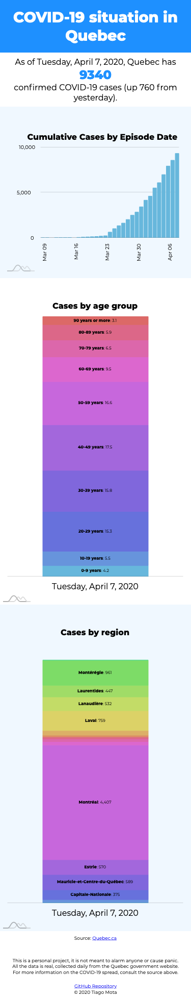

# Tracking COVID-19 in Quebec

### Simple app to track the evolution of the COVID-19 in Quebec.

Stack:

- NodeJS
- ExpressJS
- Puppeteer
- MongoDB
- amCharts
- Vanilla JS

With the new coronavirus spreading quickly throughout the world, people rely on data to understand the situation and get a sense of things to come. The Quebec government set up a [website](https://www.quebec.ca/sante/problemes-de-sante/a-z/coronavirus-2019/situation-coronavirus-quebec/) with updated information on cases, deaths and a breakdown of cases by province. Which is helpful! But the government website uses a simple table to convey all that information. Usually, graphs help people better understand data. Also, the government website doesn't contain a cumulative cases evolution, which would show people how the disease is spreading in our province. This app aims to solve both those issues.

### Getting the evolution of COVID-19 cases

When I set up to build this app, several days with confirmed cases in Quebec had already been registered. So, the first few days of data where retrieved with the help of the [Internet Archive's Wayback Machine](https://archive.org/web/). From the moment the scraper was set up and the server was connected to the MongoDB database, all data is retrieved daily from the government website and added to the database.

### Why Vanilla JS?

The bulk of the work is done by the server, scraping data from the website, and by the amCharts module. The result is, for the end user, a static page, thus a simple HTML/JS/CSS structure suffices to have the information on the page.

### **Screenshots**

Desktop version

Mobile version

